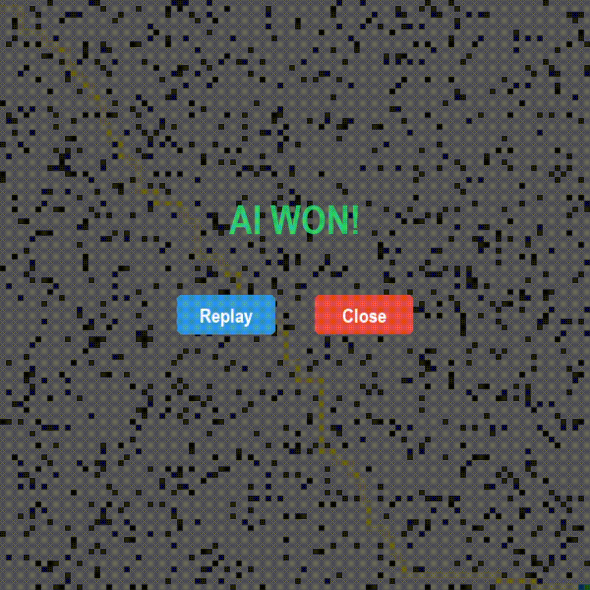
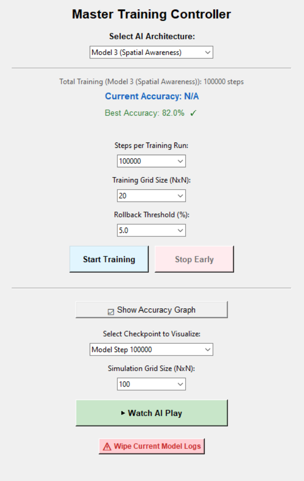
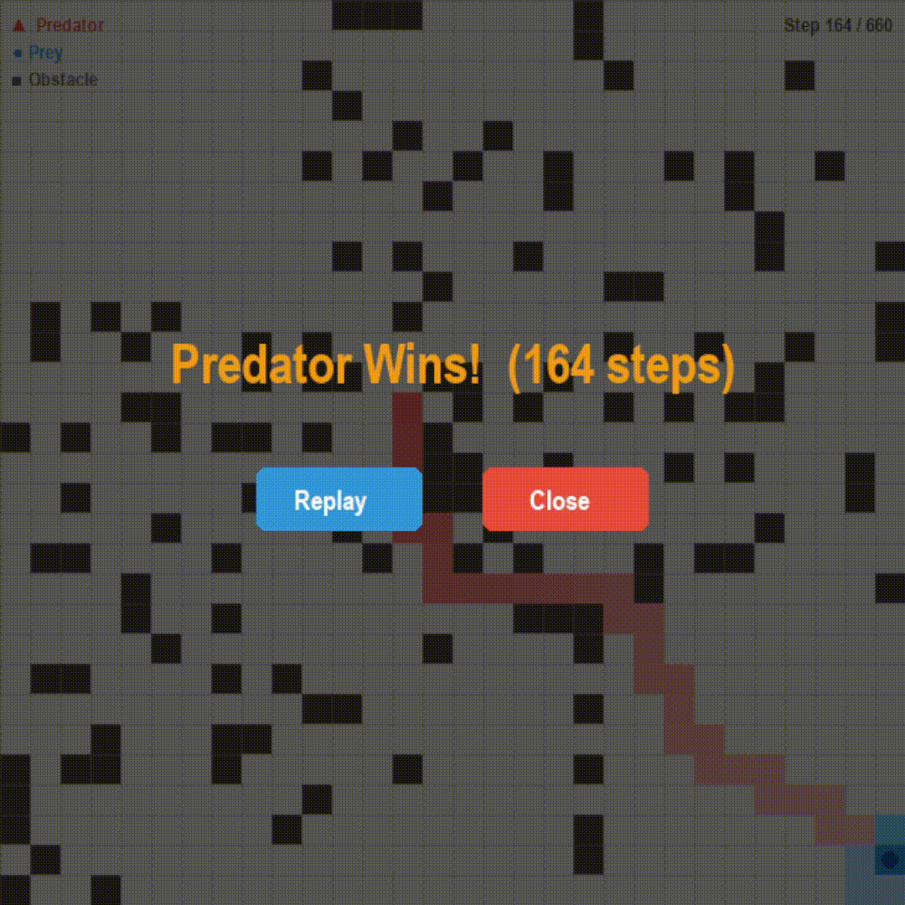
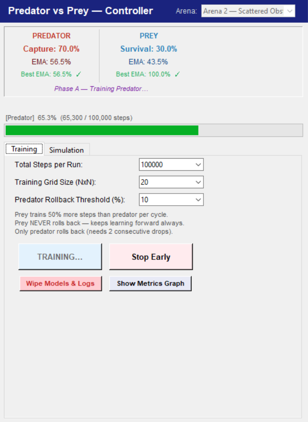

# AI Reinforcement Learning Projects

This repo is a collection of a few reinforcement learning projects I've been working on to learn more about AI training. Everything is built using Python, Stable Baselines3 (PPO), and Gymnasium.

## Project 1: Obstacle Avoidance

### Visuals
| Simulation Demo | Controller Preview |
| :---: | :---: |
|  |  |

I built an AI that learns to navigate a grid filled with random obstacles to reach a goal. I went through a few iterations to get the behavior right:

* **Model 1 (8-Sensor Radar):** The baseline model. It only knew what was directly next to it, which made it act pretty blind.
* **Model 2 (Ray-Casting):** Upgraded the AI with longer-range "LIDAR" vision so it could see walls before hitting them.
* **Model 2.1 (Stable Train):** Fixed a major issue where the AI would get stuck in infinite loops. It was too afraid to backtrack because of the point penalties, so I had to rebalance the reward system.
* **Model 3 (Spatial Awareness):** The final and most advanced version, capable of actually planning a path out of U-shaped traps and complex obstacle clusters.

---

## Project 2: Predator vs. Prey

### Visuals
| Simulation Demo | Controller Preview |
| :---: | :---: |
|  |  |

For the next step, I wanted to try Multi-Agent Reinforcement Learning (MARL). This project features two separate neural networks training in the same arena against each other.

* **The Predator:** Learns to chase down the prey as fast as possible.
* **The Prey:** Learns evasive maneuvers to stay alive.
* Because Stable Baselines3 is built for single agents, I set up a custom training loop where they take turns learning and adapting to each other's strategies.